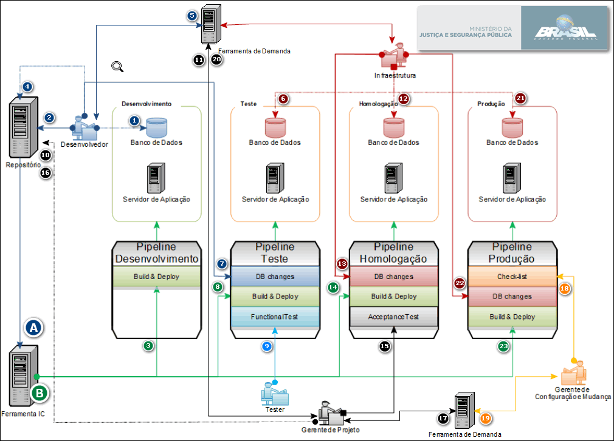

# Procedimento Técnico - Integração Contínua

<!-- TOC depthFrom:1 depthTo:6 withLinks:1 updateOnSave:1 orderedList:0 -->

- [Procedimento Técnico - Integração Contínua](#procedimento-tcnico-integrao-contnua)
	- [2\. Ferramentas envolvidas](#2-ferramentas-envolvidas)
	- [3\. Fluxo de Trabalho](#3-fluxo-de-trabalho)
		- [3.1. Configurações das Ferramentas](#31-configuraes-das-ferramentas)
			- [3.1.1. git](#311-git)
			- [3.1.2. git template](#312-git-template)
- [!/usr/bin/env bash](#usrbinenv-bash)
- [set this to your active development branch](#set-this-to-your-active-development-branch)
- [regex to validate in commit msg](#regex-to-validate-in-commit-msg)
		- [3.2. Realização do Merge Request](#32-realizao-do-merge-request)
		- [3.3. Realização do versionamento via TAG git](#33-realizao-do-versionamento-via-tag-git)
	- [4. Observações](#4-observaes)
		- [4.2. Melhorias a implementar](#42-melhorias-a-implementar)

<!-- /TOC -->

 ## 1\. Objetivo

> Descrição de atividades a serem executadas por parte dos envolvidos no processo de entrega de código, build e deploy nas ferramentas git e jenkins.

## 2\. Ferramentas envolvidas

> O acesso as ferramentas é por intermédio do usuário e senha de rede vinculados aos grupos de domínio da CGTI.

- Construção e Deploy de aplicação

  - Jenkins para Projetos **Java**: [http://java.jenkins.mj.gov.br/][07a9f215]
  - Jenkins para Projetos **PHP**:[http://php.jenkins.mj.gov.br/][de4fbf89]

- Versionamento de código

  - GIT: [http://git.mj.gov.br/][b8b896ec]

## 3\. Fluxo de Trabalho

> Abaixo segue representado Graficamente o fluxo de trabalho para integração contínua:



1. <span style="color:#004080"> **[Desenvolvedor]** </span> Realiza alterações diretamente no **banco de dados de desenvolvimento** por meio da execução de **scripts**;
2. <span style="color:#004080"> **[Desenvolvedor]** </span> Realiza a entrega do código fonte e scripts de banco de dados no repositório, no branch definido para entrega(**master**) no **fork da própria empresa**;
3. <span style="color:#008040"> **[Ferramenta IC]** </span> Por meio do processo **Automático**(**A**) realiza o deploy da aplicação em ambiente de **desenvolvimento**;
4. <span style="color:#004080"> **[Desenvolvedor]** </span> Valida alterações no ambiente de **desenvolvimento**, realiza o _**merge request**_ para o fork da **CGTI** no branch definido(**GQUAL**), realiza a marcação de _**tag**_ de versionamento;
5. <span style="color:#004080"> **[Desenvolvedor]** </span> Realiza abertura de **SATI** para a equipe de **Infraestrutura** executar alterações no **banco de dados de teste**;
6. <span style="color:#800101"> **[Infraestutura]** </span> Realiza alterações diretamente no **banco de dados de teste** por meio da execução de **scripts**;
7. <span style="color:#004080"> **[Desenvolvedor]** </span> Realiza aprovação do **Job _DB changes de teste_** após confirmação de execução do **SATI**, informando o número do **SATI** que realizou a alteração no **banco de dados de teste**;
8. <span style="color:#008040"> **[Ferramenta IC]** </span> Por meio do processo **Automático**(**B**) realiza o deploy da aplicação em ambiente de **Teste**;
9. <span style="color:#0080FF"> **[Analista de Teste]** </span> Realiza a aprovação do **Job _Functional Test_**, informando evidências dos testes executados;
10. <span style="color:#000000"> **[Gerente de Projeto]** </span> Realiza o _**merge request**_ para o fork da **CGTI** no branch definido(**master**);
11. <span style="color:#000000"> **[Gerente de Projeto]** </span> Realiza abertura de **SATI** Para a equipe de **Infraestrutura** executar alterações no **banco de dados de homologação**;
12. <span style="color:#800101"> **[Infraestutura]** </span> Realiza alterações diretamente no **banco de dados de homologação** por meio da execução de **scripts**;
13. <span style="color:#800101"> **[Infraestutura]** </span> Realiza aprovação do **Job _DB changes de homologação_** após confirmação de execução do **SATI**, informando o número do **SATI** que realizou a alteração no **banco de dados de homologação**;
14. <span style="color:#008040"> **[Ferramenta IC]** </span> Por meio do processo **Automático**(**B**) realiza o deploy da aplicação em ambiente de **Homologação**;
15. <span style="color:#000000"> **[Gerente de Projeto]** </span> Realiza aprovação do **Job _Acceptance test de homologação_** após homologação do solicitante, informando o número do **Processo SEI** com a evidência do **Aceite da demanda**;
16. <span style="color:#000000"> **[Gerente de Projeto]** </span> Realiza o _**merge request**_ para o fork da **CGTI** no branch definido(**stable**);
17. <span style="color:#000000"> **[Gerente de Projeto]** </span> Realiza abertura de demanda no **Projetos CGTI** para **Auditoria**
18. <span style="color:#FF8001"> **[Gerente de Configuração e Mudança]** </span> Realiza aprovação do **Job _Check-list de produção_** após execução da **Auditoria**, informando o número da **Demanda**;
19. <span style="color:#FF8001"> **[Gerente de Configuração e Mudança]** </span> Informa dados para o deploy em **produção**;
20. <span style="color:#000000">**[Gerente de Projeto]** </span> Realiza abertura de **SATI** para a equipe de **Infraestrutura** executar alterações no **banco de dados de produção** e realizar a aplicação de alterações em ambiente de **produção**;
21. <span style="color:#800101"> **[Infraestutura]** </span> Realiza alterações diretamente no **banco de dados de produção** por meio da execução de **scripts** após realização de backup;
22. <span style="color:#800101"> **[Infraestutura]** </span> Realiza aprovação do **Job _DB changes de produção** após confirmação de execução do **SATI**, informando o número do **SATI** que realizou a alteração no **banco de dados de produção**;
23. <span style="color:#008040"> **[Desenvolvedor]** </span> Por meio do processo **Automático**(**B**) realiza o deploy da aplicação em ambiente de **Produção**.

A. Processo iniciado pelo gatilho de alterações de código em **Branch** pré-determinada

B. Processo iniciado pelo gatilho de aprovação de outro **Job Jekins**

### 3.1. Configurações das Ferramentas

#### 3.1.1. git

A configuração do Git para o usuário, após a instalação deve ser a identificação do mesmo:

``` bash
$ git config --global user.name “Seu Nome”

$ git config --global user.email “seu@email.com”

```
Essa configuração deve ser conforme o usuário LDAP já cadastrado na ferramenta GitLab previamente

> Exemplo:
>
> 

#### 3.1.2. git template

Para melhorar a qualidade e poder haver rastreabilidade, o desenvolvedor deve criar no seu diretório de usuário os diretórios _**.git-templates\hooks**_ e criar no diretório o arquivo commit-msg com o seguinte conteúdo:

``` bash
#!/usr/bin/env bash
# set this to your active development branch
# regex to validate in commit msg
commit_regex='(SATI [0-9]+ - [a-zA-Z|0-9|.|,|\-| ]{1,120}|Redmine [0-9]+ - [a-zA-Z|0-9|.|,|\-| ]{1,120}|Issue #[0-9]+ - [a-zA-Z|0-9|.|,|\-| ]{1,120}|OS ([0-9|]+|[X][X][X][X]) - [a-zA-Z|0-9|.|,|\-| ]{1,120}|e-mail\([a-zA-Z|0-9|.]+@[a-zA-Z|0-9|.]+\) - [a-zA-Z|0-9|.|,|\-| ]{1,120})'
error_msg="Erro na validacao de expressao regular"

if ! grep -iqE "$commit_regex" "$1"; then

	echo "------------------------------- ------------------------------------"
	echo "------------------------------- ------------------------------------"
	echo "|      Erro ao realizar commit. Sua Mensagem de Commit deve        |"
	echo "|       obedecer a um dos seguintes padrões, conforme GCM:         |"
	echo "|  Issue do GitLab: 'Issue #1234 - Descricao ate 120 caracteres'   |"
	echo "|  Issue do Redmine: 'Redmine 1234 - Descricao ate 120 caracteres' |"
	echo "|       OS MJ : 'OS 1234 - Descricao ate 120 caracteres'           |"
	echo "|       SATI: 'SATI 1234 - Descricao ate 120 caracteres'           |"
	echo "|e-mail: 'e-mail(email@dominio.com) - Descricao ate 120 caracteres'|"
	echo "------------------------------- ------------------------------------"
	echo "------------------------------- ------------------------------------"
	echo "$error_msg" >&2
    exit 1
fi
```

Esse procedimento faz com que a mensagem de commit siga uma padrão e garante que será possível identificar a que demanda são as alterações relacionadas ao commit.


### 3.2. Realização do Merge Request

Para poder melhorar o versionamento e a geração de Changelogs no momento de realizar o _**merge request**_ descrito no **passo 4 do fluxo de trabalho** é importante que no título do merge request conste a mensagem com o padrão abaixo:

> V«MAIOR».«MENOR».«MICRO» - «Informação da demanda»

O esquema de numeração de versões adotado é baseado no esquema adotado pela organização Apache Foundation, definindo que uma versão é composta por quatro números inteiros, sendo que a alteração desses números segue o critério:

- MAIOR: Existe modificação na estrutura de dados ou na arquitetura do sistema, incremental;
- MENOR: Existe modificação na inclusão de um ou mais conjuntos de novas funcionalidades. Inicia com zero (zero) e deve ser reiniciado sempre que houver a troca da versão maior;
- MICRO: Existe correção de erros ou correção de comportamentos esperados no sistema. Inicia com zero (zero) e deve ser reiniciado sempre que houver a troca da versão maior ou da versão menor.

> Exemplo:
>
> 


### 3.3. Realização do versionamento via TAG git

#### Versionamento Semântico


Com o intuito de melhorar os gatilhos de construção na **Ferramenta de integração contínua**, para realizar a _**marcação de TAG**_ na ferramenta de **repositório** descrito no **passo 4 do fluxo de trabalho** é necessário realizar o merge request descrito no item 3.2 e após a aceitação do merge marcar a TAG na ferramenta **GIT**:


## 3.4. Acionamento de Build Pipeline Jenkins

A execução de Build Pipeline na ferramenta Jenkins é baseada na entrega da empresa de desenvolvimento e é iniciada a partir da Tag de Versão marcada no **passo 4 do fluxo de trabalho** conforme demonstrado a seguir

### 3.4.1 Pipeline de desenvolvimento


## 4. Observações

### 4.2. Melhorias a implementar

1. Versionamento realizado na entrega para a CGTI;
	- Com a aplicação da TAG de Versionamento na entrega pela equipe de desenvolvimento é possível fazer com que o gatilho das construções automatizadas na ferramenta de integração contínua seja disparado a partir de uma determinada versão;
	- O pipeline executado fica disponível para a versão entregue, podendo evidenciar o histórico de execução da versão do projeto;
	- Garante que toda entrega, mesmo que não finalizada, seja versionada garantindo assim o rollback no projeto;
	- Redução na quantidade de pipelines criados liberando recursos na Ferramenta IC;
	- A partir do Versionamento é possível contruir a aplicação apontando no código fonte a versão da mesma e permitindo a gestão do pacote binário com a mesma numeração.
2. Eliminação da necessidade de Fork para as empresas no repositório
	- Diminuição nos conflitos de Merge;
	- Força o rebase por parte da equipe para entrega de novo artefato;
	- Liberação de recursos no repositório, como espaço e processamento.


[07a9f215]: http://java.jenkins.mj.gov.br/ "Java Jenkins"
[b8b896ec]: http://git.mj.gov.br/ "GitLab MJ"
[de4fbf89]: http://php.jenkins.mj.gov.br/ "PHP Jenkins"
